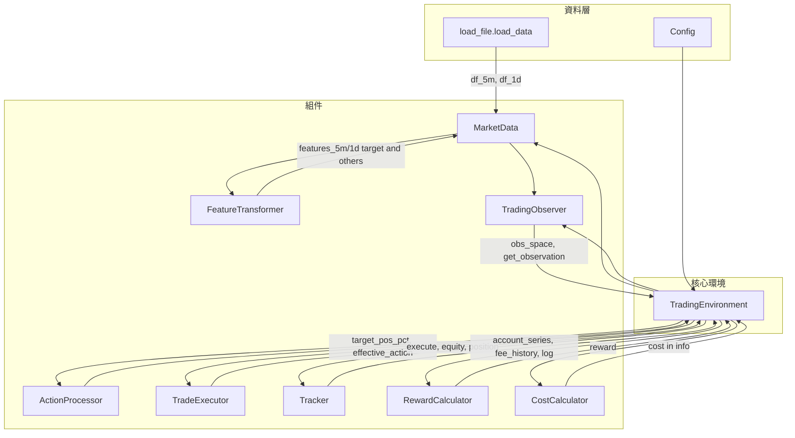
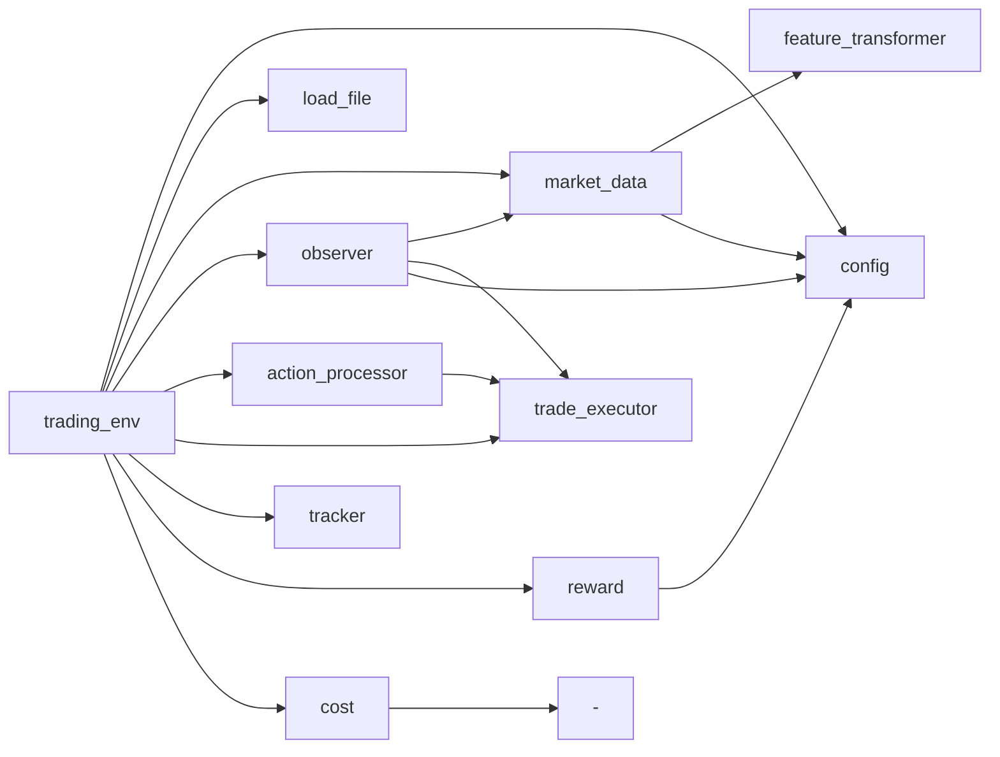

# Env 架構詳細說明

## 1. 目錄與模組一覽

| 路徑 | 職責 |
|------|------|
| [trading_env.py](trading_env.py) | 主環境 `TradingEnvironment(gym.Env)`，組裝所有組件、實作 `reset`/`step` |
| [config.py](config.py) | 常數容器 `Config`（資金、視窗、槓桿、獎勵/成本、OBS 欄位與 state keys） |
| [load_file.py](load_file.py) | 從 `Data/` 載入 `*_5min.csv`、`*_1d.csv`，合併後回傳 `(df_5m, df_1d)` |
| [feature_transformer.py](feature_transformer.py) | 將 DataFrame 轉成固定維度 5m/1d 特徵（target vs others） |
| [features.py](features.py) | 通用特徵工具（rolling z-score、EMA、MACD 等） |
| [Components/market_data.py](Components/market_data.py) | 市場數據、5m↔1d 對齊、特徵陣列、gate/regime |
| [Components/observer.py](Components/observer.py) | 觀察空間定義與單步觀察生成、風險訊號 |
| [Components/action_processor.py](Components/action_processor.py) | 動作 clip、no-trade 門檻、步幅限制、deadband |
| [Components/tracker.py](Components/tracker.py) | 帳戶序列、手續費滑窗、Step Log (JSONL) |
| [Executors/trade_executor.py](Executors/trade_executor.py) | 倉位執行、保證金/強平/止損、手續費 |
| [Rewards/reward.py](Rewards/reward.py) | 獎勵計算（log return、regime 對齊、conviction bonus）、工廠 `create_default_calculator` |
| [Costs/cost.py](Costs/cost.py) | 正規化成本（cost_risk / cost_risk_dense），供 Lagrangian 使用 |
| [wrappers.py](wrappers.py) | `ActionRepeatWrapper`（Frame Skip，累積 reward/cost） |
| [Renderers/](Renderers/) | `BaseEpisodeRenderer` 抽象、`MplfinanceEpisodeRenderer` 實作 |

對外介面：[__init__.py](__init__.py) 僅匯出 `TradingEnvironment`。

---

## 2. 高層架構與資料流

- **資料**：`load_data()` → `(df_5m, df_1d)`；前綴依檔名（如 `BTCUSDT_close`）；5m 用 inner join、1d 用 outer join。
- **特徵**：`MarketData` 內建 `FeatureTransformer`，產出 5m target/others、1d target/others 固定欄位與維度，並提供 `map_5m_to_1d`（上一根已收盤日線）、`get_gate_flags` / `get_regime_score`。
- **環境**：`TradingEnvironment` 依 `Config` 與 `kwargs` 建構，組合上述組件，實作 `reset()` / `step(action)`，並將 cost 寫入 `info` 供 Lagrangian 使用。

---

## 3. TradingEnvironment 組件職責

| 組件 | 輸入/依賴 | 輸出/職責 |
|------|------------|------------|
| **MarketData** | df_5m, df_1d, window_size, window_size_1d, target_symbol, feature_symbols | 價格陣列、ATR、特徵矩陣（5m/1d 分 target/others）、5m→1d 索引、`get_market_metrics(step)`、`get_price_seq`/`get_1d_seq`、`get_gate_flags`/`get_regime_score` |
| **TradingObserver** | window_size, window_size_1d, market_data, obs_dtype | `observation_space`（Dict）、`get_observation(...)`、`compute_risk_signals(executor, price, atr, step, total)` |
| **ActionProcessor** | leverage, max_step_pos_change_pct, min_position_change, no_trade 門檻 | `process_action(action_raw, executor, price)` → (target_pos_pct, is_flip)；`calculate_effective_action(...)` → 考慮步幅與 deadband 的實際目標比例 |
| **TradeExecutor** | initial_balance, fee_rate, leverage, min_trade_qty, margin_mode, stop_loss_atr 等 | `reset(balance)`、`execute(price, target_size, atr_est, ...)`、`equity(price)`、持倉/止損/強平/手續費 |
| **Tracker** | step_log 開關、data_len、fee_rolling_window | `account_series`（position/equity/wallet 等）、`fee_history`、`rolling_fee_sum`、`update_account_series`、`log_step` |
| **RewardCalculator** | 由 `create_default_calculator(...)` 建立，權重可來自 Config/kwargs | `compute(last_equity, new_equity, done, ..., gate_flags, regime_score)` → 主線 reward（log return + 可選 regime/conviction bonus） |
| **CostCalculator** | — | `compute(liq_triggered, equity, min_balance, episode_steps/max_steps, initial_balance)` → `cost`, `cost_risk`, `cost_risk_dense`, `cost_breakdown` |

---

## 4. 觀察空間 (Observation Space)

`observation_space` 為 `gym.spaces.Dict`，鍵由 [Config.OBS_STATE_KEYS](config.py) 決定，預設包含：

- **price_seq_target**：Box(window_size × 5m_target 特徵數)，5m 目標標的序列（欄位由 `OBS_PRICE_SEQ_TARGET_COLS` 選）。
- **price_seq_others**：Box(window_size × 5m_others 特徵數)，5m 其他標的/摘要（欄位由 `OBS_PRICE_SEQ_OTHERS_COLS` 選）。
- **price_seq_1d_target**：Box(window_size_1d × 1d_target 特徵數)。
- **price_seq_1d_others**：Box(window_size_1d × 1d_others 特徵數)。
- **account_state**：Box(22 維)，帳戶狀態（持倉、權益、回撤、強平/止損距離、手續費、冷卻、交易頻率額度等）；子集由 `OBS_ACCOUNT_STATE_COLS` 選。
- **context_state**：Box(8 維)，上一動執行結果（action 是否被覆寫、raw/used/target/final、是否成交、預測強平距離等）。
- **gate_flags**：Box(3,)，Gate A/B/C（1d 多/流動性/1d 空）multi-hot 風格。
- **regime_score**：Box(3,)，[p_up, p_down, dir_strength]。

觀察值由 `observer.get_observation(step_idx, executor, market_data, account_metrics, risk_signals, last_action_effects, precomputed_metrics)` 組裝；可傳入 `precomputed_metrics`/`precomputed_risk_signals` 以減少重算。

---

## 5. Step 流程概覽

`step(action)` 的邏輯順序（對應 [STEP_FLOW_REGIME_CHECKLIST.md](STEP_FLOW_REGIME_CHECKLIST.md)）：

1. **市場輸入**：`get_market_metrics(current_step)`、`_prepare_step_prices`、可選 `_maybe_update_daily_risk_base`。
2. **動作與執行**：`_process_action_and_execute(action, ...)`  
   - 止損冷卻檢查 → `_apply_regime_action_projection(action)`（依 `get_gate_flags` 將連續動作投影：A→[0,1]、C→[-1,0]、neutral→0）  
   - `ActionProcessor.process_action` → target_pos_pct、is_flip  
   - `ActionProcessor.calculate_effective_action` → 步幅與 deadband 限制  
   - `TradeExecutor.execute(...)` 更新倉位；其內處理止損/強平。
3. **執行後更新**：`_update_action_effects_cache`、寫入 `_last_action_effects`（last_action_raw/used、target/final_pos_pct、trade_executed、cooldown、trade_freq_blocked 等）、更新持倉進場步數、手續費與 Tracker。
4. **Mark-to-market**：`_mark_to_market()` → 下一步 close 為 mark_price、new_equity。
5. **獎勵相關**：`_compute_reward_features`、episode 統計（turnover、holding_steps、trade_count、max_dd、active_exit、flat_steps）、止損/強平計數。
6. **終止判斷**：`_determine_termination(data_exhausted, max_steps_reached, balance_insufficient, liq_triggered)` → (terminated, truncated, reason)。
7. **Reward**：`reward_calculator.compute(..., gate_flags=..., regime_score=..., position_pct=...)`；累加 episode_conviction_bonus、episode_log_return_sum、episode_regime_alignment_bonus_sum。
8. **Cost**：`cost_calculator.compute(liq_triggered, equity, min_balance, episode_steps, episode_max_steps, initial_balance)` → 寫入 `info['cost']`、`info['cost_risk']`、`info['cost_risk_dense']`、`info['cost_breakdown']`；另寫入 `info['cost_trade_freq']`、`info['cost_flat']`。
9. **事件與步進**：`_record_step_events`（entry/reduce/close/flip/SL/LIQ）、`current_step++`、`episode_steps++`、空倉滑窗更新。
10. **Info 與日誌**：`_build_step_info`、寫入 cost 相關鍵、Tracker.log_step、`update_account_series`；若 `render_on_done` 且 done 則呼叫 `render()`。
11. **回傳**：`_get_observation()`、reward、terminated、truncated、info。

---

## 6. 獎勵與成本分離

- **獎勵（主線）**：[Rewards/reward.py](Rewards/reward.py)  
  - 以資產對數報酬為主（`base_log_ret_weight * log(new_equity/last_equity)`）。  
  - 可選：Regime 對齊 bonus（A 多、C 空，依 `dir_strength` 加權）、Conviction trend bonus（強訊號+大倉+同向）；終局懲罰不在主線，改由 cost 表示。
- **成本（約束線）**：[Costs/cost.py](Costs/cost.py)  
  - 正規化：死亡事件 `cost_risk`（1.0 + 剩餘步數比例）；每步 dense 緩衝 `cost_risk_dense`（(1−buffer_ratio)²）；`cost` 僅為死亡通道（不含 dense）。摩擦由 PnL 反映，無 `cost_fric`。  
  - `info` 另提供 `cost_trade_freq`、`cost_flat` 供多 λ 或統計使用。

---

## 7. 資料與特徵

- **load_file**：讀取 `Data/*_5min.csv`、`Data/*_1d.csv`，依檔名推 prefix（如 BTCUSDT、fear_greed）；5m 以 timestamp inner join，1d 以 outer join 合併；必要欄位含 `timestamp`。
- **MarketData**：  
  - 使用 `FeatureTransformer.build_5m_features_split` / `build_1d_features_split` 產出 target 與 others 特徵矩陣與欄位名。  
  - 5m 執行軸；1d 對齊策略為「上一根已收盤日線」（`map_5m_to_1d = searchsorted - 2` 邊界保護）。  
  - Gate/Regime：依 1d 趨勢與 5m 流動性等定義 A/B/C 與 regime_score，供 action projection 與 reward 使用。
- **FeatureTransformer**：依 [config.py](config.py) 中各 `OBS_*_COLS` 對應的欄位（或預設固定清單）產出固定維度，避免 observation 維度隨資料變動。

---

## 8. 訓練/評估相關

- **Train/Eval 切分**：`data_split_enabled=True` 且 `data_mode in ("train","eval")` 時，依 `holdout_months` 以「最近 N 個月」切分；eval 時可設 `ensure_filled_obs=True` 讓起始點在 warmup 之後以保證 obs 填滿。
- **Wrappers**：`ActionRepeatWrapper(env, repeat=N)` 每步將同一 action 執行 N 次、累加 reward 與 cost，遇止損/強平/終止則中斷 repeat。
- **Render**：僅在 episode 結束時可選繪圖；`render_on_done=True` 時在 done 那一步呼叫 `render()` 並將路徑寫入 `info['render_path']`，以配合 VecEnv 自動 reset。

---

## 9. 依賴關係簡圖

以上即為 Env 的完整架構：單一入口 `TradingEnvironment`、參數集中於 Config、資料與特徵由 load_file + MarketData + FeatureTransformer 負責、觀察與風險由 Observer 負責、動作由 ActionProcessor 與 Regime 投影處理、執行與帳務由 TradeExecutor、獎勵與成本分離由 Reward 與 Cost 模組負責、追蹤與繪圖由 Tracker 與 Renderers 負責，適合擴充新標的、新特徵或新約束（含 Lagrangian 多 cost 通道）時維持單一職責與介面穩定。

---

# 各方面更詳細說明

## 10. Config 參數詳解

[config.py](config.py) 的 `Config` 類別為唯讀常數容器，依功能分組如下。

- **資金與交易成本**  
  - `INITIAL_BALANCE`（預設 500）：初始權益。  
  - `TRANSACTION_FEE`（預設 0.01）：手續費百分比（0.01 表示 0.01%）；Executor 內 `_fee(notional) = abs(notional) * (fee_rate/100)`。

- **視窗與步數**  
  - `WINDOW_SIZE`（預設 432 = 288×1.5）：5m 觀察序列長度（根數）。  
  - `WINDOW_SIZE_1D`（預設 30）：1d 觀察序列長度。  
  - `MIN_EPISODE_STEPS` / `MAX_EPISODE_STEPS`（預設 288×31）：單一 episode 最少/最多步數（以 5m 為單位）。  
  - `RISK_BASE_UPDATE_STEPS`（預設 288）：每 N 步更新 `daily_risk_base`（用於單步倉位變化上限的基準）。

- **槓桿與倉位限制**  
  - `LEVERAGE`（預設 10）、`MIN_BALANCE`（預設 INITIAL_BALANCE×0.6）、`MIN_POSITION_CHANGE`（deadband，預設 0）、`MAX_STEP_POS_CHANGE_PCT`（預設 0.5）、`MAX_POSITION_PCT`（預設 0.8，供 ActionClipWrapper）。  
  - `NO_TRADE_ENTRY_THRESHOLD` / `NO_TRADE_EXIT_THRESHOLD`：空倉時 |action| < ENTRY 不進場；有倉時 |action| < EXIT 易回空倉（hysteresis）。

- **主線獎勵（順向/Regime）**  
  - `CONVICTION_TREND_BONUS_WEIGHT`、`CONVICTION_TREND_MIN_STRENGTH`、`CONVICTION_MIN_ABS_POS`、`CONVICTION_TREND_SCORE_SCALE`、`REGIME_ALIGNMENT_BONUS_WEIGHT`：控制 Conviction/Regime 對齊 bonus，0 表示不啟用。

- **止損與清算**  
  - `STOP_LOSS_ATR`（止損距離 ATR 倍數）、`STOP_LOSS_LIQ_BUFFER_PCT`（止損相對強平價緩衝）、`STOP_LOSS_COOLDOWN_STEPS`、`STOP_LOSS_EVENT_COST`、`STOP_BUFFER_*`、`LIQUIDATION_WARN_PCT`、`STOP_LOSS_WARN_PCT`。

- **Observation**  
  - `OBS_DTYPE`（"float16"|"float32"）、`OBS_INF_CLIP_HIGH/LOW`（取代 inf 的有限值）。  
  - `OBS_STATE_KEYS`：納入 obs 的 state 鍵名（預設 8 個：price_seq_target、price_seq_others、price_seq_1d_target、price_seq_1d_others、account_state、context_state、gate_flags、regime_score）。  
  - `OBS_PRICE_SEQ_TARGET_COLS`、`OBS_PRICE_SEQ_OTHERS_COLS`、`OBS_PRICE_SEQ_1D_TARGET_COLS`、`OBS_PRICE_SEQ_1D_OTHERS_COLS`：各 state 內要輸出的特徵欄位（空 tuple = 全部）。  
  - `OBS_ACCOUNT_STATE_NAMES`（22 維完整名稱）、`OBS_ACCOUNT_STATE_COLS`（子集，空=全部）；`OBS_CONTEXT_STATE_NAMES`（8 維）、`OBS_CONTEXT_STATE_COLS`（子集）。

---

## 11. load_file 資料載入詳解

- **檔案規則**：`Data/*_5min.csv`、`Data/*_1d.csv`；若無任一 5m 或 1d 檔案則拋錯。  
- **前綴推導** `_infer_prefix(basename)`：  
  - 檔名首段含 "USDT" → 前綴為該段（如 `BTCUSDT`）；  
  - 檔名結尾為 `_index_history_1d` → 前綴為去掉該後綴的 stem（如 `fear_greed`）；  
  - 否則前綴為檔名第一個 `_` 前段。  
- **欄位重新命名**：除 `timestamp` 外，其餘欄位皆改為 `{prefix}_{原欄位名}`（如 `BTCUSDT_close`）。  
- **時間欄位**：必須有 `timestamp` 或 `time`，統一轉成 `timestamp` 且為 datetime。  
- **5m 合併**：多檔依 `timestamp` **inner** join，確保多幣 5m 時間軸完全對齊、無缺 bar 導致 NaN。  
- **1d 合併**：多檔依 `timestamp` **outer** join，避免單一來源缺段導致整體變空。  
- **後處理**：sort by timestamp、drop_duplicates(subset='timestamp')、reset_index；回傳 `(df_5m, df_1d)`。

---

## 12. MarketData 詳解

- **建構**：接收 `df_5m`、`df_1d`、`window_size`、`window_size_1d`、`target_symbol`、`feature_symbols`（可選）。  
  - 確保 timestamp 為 datetime（`_ensure_datetime`）。  
  - 建立 5m→1d 索引：`times_5m`、`times_1d`，`idx_asof = np.searchsorted(times_1d, times_5m, side='right') - 1`，再減 1 得到「上一根已收盤日線」→ `map_5m_to_1d = np.maximum(idx_asof - 1, -1)`。  
  - 目標價格陣列：依 `target_symbol` 取 `{symbol}_close/high/low/open`，fallback 為 `close/high/low/open`；產出 `close_arr`、`high_arr`、`low_arr`、`open_arr`、`atr_ratio_arr`、`rv_ratio_arr`、`trend_score_arr`（ma50-ma200 比例）。  
  - 呼叫 `FeatureTransformer.build_5m_features_split` / `build_1d_features_split` 得到 `features_5m_target_arr`、`features_5m_others_arr`、`cols_5m_target`、`cols_5m_others` 與 1d 對應；定義各 `price_seq_*_features_dim`。  
  - 建構 Gate 與 Regime 陣列：`_build_gate_arrays()` → `_trend_1d_5m`（1d EMA12-EMA48 對齊到 5m）、`_liquidity_5m`（5m 流動性：quote_volume_log_z > 中位數且 amihud_z < 中位數）；`_build_regime_score_5m()` → `_p_up_5m`、`_p_down_5m`、`_dir_strength_5m`（由 1d EMA 差正規化後 sigmoid 得到）。

- **主要 API**：  
  - `get_market_metrics(step_idx)`：回傳 dict，鍵為 `close`、`high`、`low`、`atr_ratio`、`rv_ratio`、`trend_score`。  
  - `get_price_seq(step_idx)`：回傳 `(seq_target, seq_others)`，shape 分別為 `(window_size, F_target)`、`(window_size, F_others)`；若 start<0 則左側以 0 填充。  
  - `get_1d_seq(step_idx, window_size_1d)`：依 `map_5m_to_1d[step_idx]` 取 1d 索引，往回取 `window_size_1d` 根，回傳固定 shape 的 target/others 矩陣（不足處填 0）。  
  - `get_gate_flags(step_idx)`：shape (3,)，[gate_A, gate_B, gate_C]；A=1 表 1d up，B=1 表 5m 高流動性，C=-1 表 1d down。  
  - `get_regime_score(step_idx)`：shape (3,)，[p_up, p_down, dir_strength]。

---

## 13. FeatureTransformer 詳解

- **職責**：僅做 DataFrame → 固定維度特徵矩陣，不依賴環境 step；輸出 float32、NaN/inf 已處理。  
- **5m Target**：欄位與 `Config.OBS_PRICE_SEQ_TARGET_COLS` 一致（如 ret_15m_scale、body_z、range_atr、volume 相關、amihud、ema 斜率、支撐/阻力、ob depth 等）。  
- **5m Others**：每標的為 `{SYMBOL}_xxx`，base 名稱由 `Config.OBS_PRICE_SEQ_OTHERS_COLS` 定義；`build_5m_features_split` 需傳入 `target_symbol`、`atr_ratio_arr`、`rv_ratio_arr`、`z_window`、`feature_symbols`。  
- **1d Target/Others**：欄位由 `OBS_PRICE_SEQ_1D_TARGET_COLS`、`OBS_PRICE_SEQ_1D_OTHERS_COLS` 定義；others 含 per-symbol 與 macro（如 fear_greed、sopr）；`build_1d_features_split` 需 `df_1d`、`df_5m`、`target_symbol`、`z_window_1d`、`feature_symbols`。  
- **輔助**：`_get_symbol_col`、`_get_symbol_col_first_of` 處理 `{symbol}_close` 或 fallback `close`；rolling z-score、clip 等與 `features.py` 工具一致、僅用過去資料。

---

## 14. TradingObserver 詳解

- **observation_space**：Dict，鍵為 `OBS_STATE_KEYS` 的子集；每個鍵對應一個 `Box`。  
  - 市場四序列：`price_seq_target`、`price_seq_others`、`price_seq_1d_target`、`price_seq_1d_others`，shape 為 (window_size 或 window_size_1d, 有效特徵數)；有效特徵數由 Config 對應 `*_COLS` 與 market_data 欄位解析出的索引長度決定。  
  - `account_state`：shape `(_eff_account_state_dim,)`，dtype 為 `obs_dtype`（float16/float32）。  
  - `context_state`：shape `(_eff_context_state_dim,)`。  
  - `gate_flags`：Box(3,)，low=-1、high=1。  
  - `regime_score`：Box(3,)，low=0、high=1。

- **account_state 22 維順序**（與 `Config.OBS_ACCOUNT_STATE_NAMES` 一致）：  
  position_side、position_size_norm、equity_ratio、realized_pnl_ratio、unrealized_pnl_atr、drawdown、liq_distance_atr、stop_loss_distance_atr、margin_usage_ratio、cooldown_remaining_norm、fee_rate、rolling_fee_ratio、trade_count_log、stop_loss_count_log、holding_time_log、buffer_to_min_balance_ratio、steps_since_trade_norm、trade_freq_remaining_ratio、trade_freq_blocked_last、entry_price_ratio、stop_loss_price_ratio、recent_flat_ratio。  
  各維均有 clip 範圍（如 drawdown∈[0,1]、liq_distance_atr∈[0,10]），無倉位或無止損時以預設安全值填入。

- **context_state 8 維**：action_overridden、last_action_raw、last_action_used、last_target_pos_pct、last_final_pos_pct、trade_executed_flag、predicted_liq_distance_after、available_balance_after_norm；來自 `last_action_effects`。

- **compute_risk_signals(executor, current_price, atr_est, step_idx, total_steps)**：回傳 dict，包含 liq_price、price_gap、gap_pct、abs_gap_pct、margin_ratio、sl_gap_pct、sl_gap_atr、abs_sl_gap_atr、stop_loss_missing、near_liq、near_margin、near_stop；用於 account_obs 與後續 cost/obs。

- **get_observation(...)**：組裝 market_obs、account_obs、context_obs、gate_obs、regime_score_obs；依 `_obs_state_keys` 篩選；對非市場序列做 nan_to_num 與 inf clip（Config.OBS_INF_CLIP_*）；市場序列維持 float32、其餘用 obs_dtype；保證 c_contiguous。

---

## 15. ActionProcessor 詳解

- **process_action(action_raw, executor, current_price)**：  
  1. 將 action 取 `action[0]` 並 clip 到 [-1,1] 得到 `target_pos_pct`。  
  2. 計算當前倉位比例 `current_pos_pct = (size*price)/(equity*leverage)`。  
  3. No-trade 雙門檻：若空倉且 |target_pos_pct| < no_trade_entry_threshold → target_pos_pct=0；若有倉且 |target_pos_pct| < no_trade_exit_threshold → target_pos_pct=0。  
  4. 翻倉標記：`is_flip = (target_pos_pct * current_pos_pct < -0.01)`。  
  回傳 `(target_pos_pct, is_flip)`。

- **calculate_effective_action(target_pos_pct, executor, current_price, risk_base)**：  
  1. 將 target_pos_pct 換算成 `desired_size`（BTC 單位）。  
  2. 單步變化上限：`max_change_qty = (risk_base * leverage * max_step_pos_change_pct) / price`；若**非**減倉（同向且 |desired| < |current|）則將 `change = desired_size - current_size` 限制在 ±max_change_qty 內，再反推 `desired_size`。  
  3. 將最終 desired_size 換算回「持倉比例」`final_action_pct` 回傳。  
  注意：最小調倉幅度（deadband）主要在 Executor 內以 `min_position_change` 與 `min_trade_qty` 處理。

---

## 16. TradeExecutor 詳解

- **狀態**：`PositionState(size, entry_price, stop_loss_price, liq_price)`、`wallet_balance`、`used_margin`、`total_fees`、進出場計數等。  
- **equity(price)**：`wallet_balance + unrealized_pnl(price)`；`unrealized_pnl(price) = (price - entry_price) * size`。  
- **手續費**：`_fee(notional) = abs(notional) * (fee_rate/100)`；開/平倉皆依成交名目計收。  
- **保證金**：`_required_margin(size, price) = abs(size)*price/leverage`；isolated 下 `used_margin` 與持倉一致更新，避免強平價失真。

- **execute(position_percent, current_price, high, low, equity, atr, risk_base)** 流程：  
  1. 先用**上一根 K** 的 high/low 呼叫 `_maybe_update_trailing_stop_from_prev_bar(atr)` 更新止損（只會更緊）。  
  2. 清算檢查：若有倉且本根 K 的 low/high 觸及強平價則 `_close_position(liq_price)`、設 `liq_triggered=True` 並 return。  
  3. 止損檢查：若未強平且本根 K 觸及 `stop_loss_price` 則 `_close_position(stop_loss_price)`、`stop_loss_triggered=True` 並 return。  
  4. 以 `risk_base`（或預設 wallet/equity 較小值）與 `position_percent` 計算 `target_size`；若 |target_size| < min_trade_qty 則視為 0。  
  5. 最小調倉：`change_ratio = |target_size - position.size| / max_capacity_size`；若 change_ratio < min_position_change 且非平倉則 return。  
  6. 若當前空倉則可開倉 `_increase_position`；若有倉且方向反轉則先 `_close_position` 再依新方向開倉；同向則依 delta 呼叫 `_reduce_position` 或 `_increase_position`。  
  7. 最後 `_cache_prev_bar(high, low)` 供下一步 trailing 使用。

- **強平價** `_calc_liquidation_price`：isolated 下 collateral=used_margin；equity(p)=collateral+unrealized_pnl(p)，maintenance_margin(p)=|size|*p*mmr；令兩者相等解出 p（多/空公式不同）。  
- **止損**：開倉/加倉時設 `stop_loss_price = entry ± atr*stop_loss_atr`；`_clamp_stop_loss_before_liquidation` 確保止損一定先於強平觸發。

---

## 17. Reward 與 Cost 公式詳解

- **RewardCalculator.compute**：  
  - 主線：`reward = base_log_ret_weight * log(new_equity / last_equity)`；nan/inf 替換為 0。  
  - Regime 對齊（當 regime_alignment_bonus_weight > 0）：regime_dir = 1（A）或 -1（C）或 0；align = position_pct * regime_dir；regime_bonus = weight * dir_strength * clip(align, -1, 1)；加進 reward。

- **ConvictionTrendRewardCalculator**（當 conviction_trend_bonus_weight > 0）：  
  - 先呼叫 `super().compute(...)` 得到 base。  
  - strength = |tanh(conviction_trend_score_scale * trend_score)|；若 strength < conviction_trend_min_strength 或 abs_position_pct < conviction_min_abs_pos 則直接回傳 base。  
  - align = position_pct * trend_dir（trend_dir = tanh(scale*trend_score)）；gate_s、gate_p 為強度/倉位門檻的線性插值；bonus = weight * gate_s * gate_p * align；再加上 base 與（若啟用）regime_alignment_bonus。

- **CostCalculator.compute**：  
  - 死亡：`is_dead = liq_triggered or (equity <= min_balance)`；若死亡且提供 episode_steps 與 episode_max_steps，則 `c_death = 1.0 + (remaining_steps / episode_max_steps)`，區間 [1.0, 2.0]；否則 c_death=1.0。  
  - cost_risk = c_death；`cost_risk_dense` = (1−buffer_to_min_ratio)²（有 initial_balance 時）；`cost` = c_death；`cost_breakdown` = {death_cost, dense_buffer_cost}。  
  - 回傳 dict：cost、cost_risk、cost_risk_dense、cost_breakdown。

---

## 18. Tracker 與 Render 詳解

- **Tracker**：  
  - `account_series`：鍵為 position、position_value、equity、wallet（正規化至 initial_balance）以及 position_size、position_value_raw、equity_raw、wallet_raw（原始值，未填處為 NaN）。  
  - `update_account_series(step_idx, executor, current_price)`：寫入上述序列在 step_idx 的值。  
  - `fee_history`：deque of (step_index, fee_amount)；`update_fee_tracking(step_idx, total_fees)` 更新 rolling_fee_sum、last_step_fee。  
  - `log_step(payload, episode_steps, force)`：若 step_log_enabled 且 (force 或 episode_steps % step_log_every_n == 0) 則寫入 JSONL。

- **BaseEpisodeRenderer**：抽象方法 `render_episode(env, info) -> Optional[str]`，回傳存檔路徑或 None。  
- **MplfinanceEpisodeRenderer**：使用 env 的 account_series、market_data.close_arr、_episode_events（entry/reduce/close/flip/SL/LIQ）；在圖上顯示 Return%、PnL、Max DD、Fees、Trades、SL/LIQ、Steps、Term、可選 Unrealized PnL/Entry 等；可存檔與可選 show。

---

## 19. Step 流程逐項對照（方法名與資料）

| 序 | 說明 | 方法/來源 |
|----|------|-----------|
| 1 | 記錄 step_idx，取市場指標 | get_market_metrics(current_step)，_prepare_step_prices → _StepPrices |
| 2 | 更新 daily_risk_base（可選） | _maybe_update_daily_risk_base() |
| 3 | 動作處理與執行 | _process_action_and_execute：_apply_stop_loss_cooldown → _apply_regime_action_projection → action_processor.process_action → calculate_effective_action；交易頻率硬限制檢查；_estimate_expected_fee；executor.execute |
| 4 | 寫入 last_action_effects | _update_action_effects_cache；手動寫入 last_action_raw/used、target/final_pos_pct、action_overridden_flag、trade_freq_blocked |
| 5 | 持倉進場步數、手續費 | _update_position_entry；_update_fee_tracking → step_fee, safe_equity |
| 6 | Mark-to-market | _mark_to_market() → mark_price（下一步 close）、new_equity；更新 max_equity_so_far |
| 7 | 獎勵特徵與 episode 統計 | _compute_reward_features → position_change, traded, position_change_norm, turnover_ratio, current_dd；更新 episode_turnover_notional、episode_trade_count、episode_holding_steps、episode_max_dd、last_trade_step；_update_episode_event_counters → stop_loss_triggered, liq_triggered；寫入 trade_executed_flag、cooldown_remaining_norm、episode_active_exit_count |
| 8 | 終止判斷 | data_exhausted、max_steps_reached、balance_insufficient、liq_triggered → _determine_termination → terminated, truncated, termination_reason |
| 9 | Reward | get_gate_flags(step_idx)、get_regime_score(step_idx)；reward_calculator.compute(..., gate_flags, regime_score, position_pct, ...)；累加 episode_conviction_bonus_sum、episode_log_return_sum、episode_regime_alignment_bonus_sum |
| 10 | Cost | observer.compute_risk_signals；cost_calculator.compute(liq_triggered, equity, min_balance, episode_steps, episode_max_steps, initial_balance)；寫入 info cost/cost_risk/cost_risk_dense/cost_breakdown/cost_trade_freq/cost_flat |
| 11 | 事件與步進 | _record_step_events；current_step += 1；episode_steps += 1；_last_position_size；flat 判斷與 episode_flat_steps、_flat_deque、_recent_flat_ratio；trade_freq_deque.append |
| 12 | Info 與日誌 | _build_step_info；info 寫入 cost 相關；_last_info = info；_build_log_payload → tracker.log_step；tracker.update_account_series(current_step, executor, mark_price) |
| 13 | Render on done | 若 done 且 render_on_done 且未 render 過則 render()，info['render_path'] = 路徑 |
| 14 | 回傳 | reward 有限值檢查；return _get_observation(), reward, terminated, truncated, info |

---

## 20. Reset 流程詳解

- 決定起始點：warmup_steps = max(window_size, window_size_1d*288)（若 ensure_filled_obs）否則 window_size；若 random_start 則在 [warmup_steps, len(df_5m)-min_episode_steps-2] 間隨機，否則取 warmup_steps。  
- episode_start_step、episode_start_timestamp、episode_max_steps；episode_steps=0、done=False。  
- 組件重置：executor.reset(initial_balance)；tracker.fee_history.clear、rolling_fee_sum=0、prev_total_fees=0。  
- 清空 _episode_events、_last_info、_rendered_this_episode；重置 risk_budget、max_equity_so_far、episode_* 計數、last_trade_step、position_entry_step、_last_position_size、stop_loss_cooldown、daily_risk_base、_last_action_effects（含各 0 與 last_* 欄位）。  
- 初始化 _trade_freq_deque（若啟用）、_flat_deque、_recent_flat_ratio。  
- 取得初始 metrics、update_account_series、compute_risk_signals；回傳 _get_observation(precomputed_metrics, precomputed_risk_signals) 與 info（episode_start_step、episode_start_timestamp）。

---

## 21. Wrappers 詳解

- **ActionRepeatWrapper(env, repeat=N)**：  
  - step(action) 時迴圈最多 N 次呼叫 env.step(action)；累加 total_reward、total_step_fee、total_cost、total_cost_channels、total_cost_breakdown；若 info 有 cost_trade_freq>0 則 any_trade_in_repeat=True；累加 cost_flat、n_steps。  
  - 若 done、truncated、stop_loss_triggered 或 liq_triggered 則**立即 break**。  
  - 回傳前將 info 的 step_fee_ratio、cost、cost_risk、cost_risk_dense、cost_trade_freq（任一步有交易則 1）、cost_flat（repeat 內平均）、cost_breakdown 設為累積值。  
  - 回傳 (obs, total_reward, done, truncated, info)。

- **ActionClipWrapper(env, max_position_pct)**：將 action clip 到 [-max_position_pct, max_position_pct]，輸出 float32。

---

## 22. 小結

以上補充了 Config 分組、load_file 前綴與合併規則、MarketData 建構與 API、FeatureTransformer 輸入輸出、Observer 觀察空間與 22/8 維含義、ActionProcessor 兩方法邏輯、TradeExecutor 執行順序與強平/止損、Reward/Cost 公式、Tracker 與 Render、Step 逐步對照表、Reset 流程、Wrappers 行為。可與前文「目錄一覽」「高層架構」「組件職責」「Step 概覽」「獎勵與成本」「資料與特徵」「訓練/評估」「依賴關係」對照使用。
